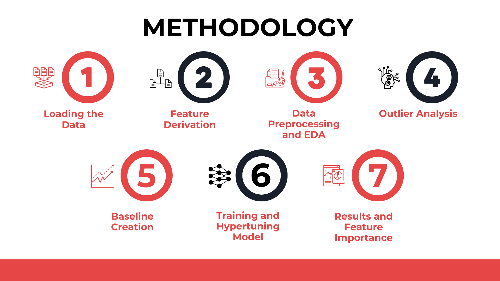

## Overview

This project aims to predict occupancy ratings for airbnb listings using the listings and reviews data available.

Utilizing AWS EMR and S3, this project leveraged Apache Spark to train an ML model that used derived features and made predictions on what a particluar airbnb's occupancy would look like. In order to to gain actionable insights, further feature importances were also rooted out to help understand which features were more important.
The model was able to achieve a mae and rmse  of 0.2 and 0.26, which comprehensively beat the baseline of 0.32 and 0.41

## Notes

 * The data used for the project has been accessed from ***Asian intitute of management's*** public repository of data but the same is available on the [Inside airbnb website](anish0330/HybridRecommenderSystem) and can be downloaded from there.
 * Since the project was done using AWS, the notebook will not run without proper modifications made to the file names and pathways to the data. ***Please look into creating an AWS account before trying to run the notebook***
